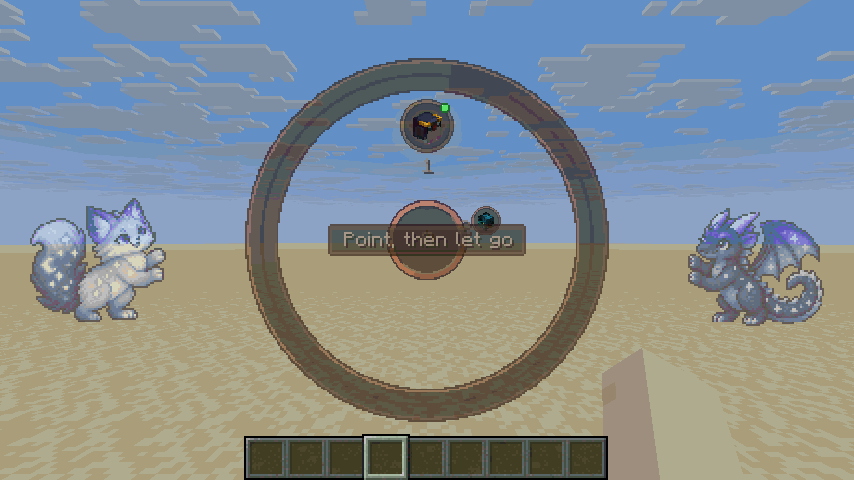
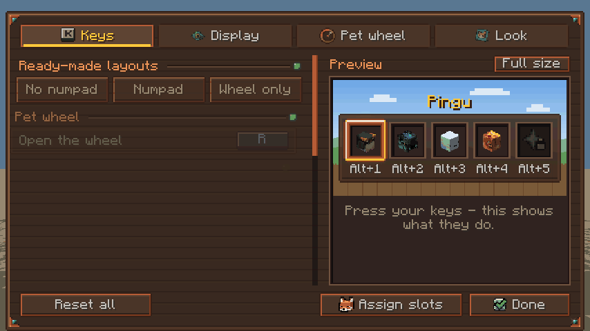
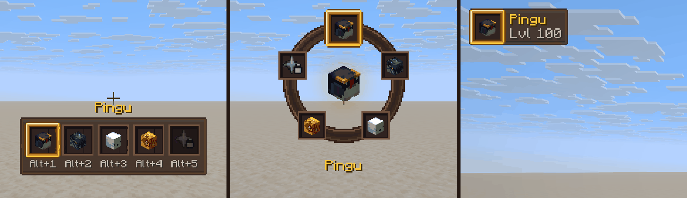

<div align="center">


# Better Pets Quickslots

### Swap pets with a flick of the mouse.

[](https://www.minecraft.net)
[](https://fabricmc.net)
[](https://github.com/yourShika/betterpets-paper)
[](LICENSE)
[](#built-with-ai-assistance)

[**Download**](https://github.com/yourShika/betterpets-quickslots/releases/latest) ·
[Report a bug](https://github.com/yourShika/betterpets-quickslots/issues/new) ·
[Better Pets plugin](https://github.com/yourShika/betterpets-paper)

</div>

## What it does

On a server that runs the [Better Pets](https://github.com/yourShika/betterpets-paper) plugin
you can park your favourite pets in *quickslots*. The plugin can already switch between them
by command. This mod adds what a server cannot give a vanilla client:



- **A pet wheel.** Hold <kbd>R</kbd>, point at a pet, let go. Only the direction counts, you
  do not have to hit anything.
- **A modifier key.** Hold <kbd>Left Alt</kbd> and press <kbd>1</kbd> – <kbd>9</kbd>, or turn
  the mouse wheel. Works on every keyboard — no numeric keypad needed — and takes no key away
  from the game: without <kbd>Alt</kbd> the number keys do what they always do.
- **Direct keys**, if you prefer them: one per quickslot, plus next, previous and put away.
- **A slot screen.** Pick a slot, click a pet, done. No chest menu, no commands.
- **A display on your HUD** that shows your quickslots when something happens — as a bar, as
  a ring, or as just the pet that is out.
- **Settings with a live preview.** Every key, when and where the display shows, how large the
  wheel is, how much moves: all of it in one screen that acts each change out as you make it.
- **A Quickslots button in `/pets`.** Right on the plugin's own pet menu.


## Installation

1. You need **[Fabric Loader](https://fabricmc.net/use/installer/) 0.19.3 or newer** and
   **[Fabric API](https://modrinth.com/mod/fabric-api)**.
2. [Download the mod](https://github.com/yourShika/betterpets-quickslots/releases/latest) and
   drop the `.jar` into your `mods` folder.
3. Join a server that runs **Better Pets 1.32.0 or newer**.

Client-side only. On a server without the plugin the mod does nothing at all, so it is safe
to leave in a modpack.

## Switching pets

Three ways, usable side by side. Out of the box the first two are set up:

| Way | How | Default |
| --- | --- | --- |
| Pet wheel | hold the key, point at a pet, let go | <kbd>R</kbd> |
| Modifier key | hold it and press <kbd>1</kbd> – <kbd>9</kbd>, or turn the mouse wheel | <kbd>Left Alt</kbd> |
| Direct keys | one key per slot, next, previous, put away | not bound |

Other keys:

| Action | Default |
| --- | --- |
| Open the slot screen | <kbd>K</kbd> |
| Open the settings | not bound |
| Open the pet menu (`/pets`) | not bound |

Everything can be rebound in the mod's settings (and under **Options → Controls → Key Binds →
Better Pets**). The settings also have three ready-made layouts: **No numpad** (the defaults
above), **Numpad** (adds direct keys on the numeric keypad) and **Wheel only**.

Summoning the pet that is already out puts it away again (a server can turn that off). In the
wheel, a short tap of the key instead of a hold leaves it open — then a click chooses, and so
do the keys <kbd>1</kbd> – <kbd>9</kbd>.

## Settings



Open them with the gear button in the slot screen, with their own key, or through
[Mod Menu](https://modrinth.com/mod/modmenu) if you have it.

- **Keys** — every binding, the ready-made layouts, and a tester: press any of your keys and
  the preview shows what it would do. Nothing is sent to the server.
- **Display** — bar, ring, compact or off. When it appears: after a change of pet (and for how
  long), while the modifier key is held, or always. Where it sits, how large and how
  see-through it is, and whether it shows names, keys and empty slots. The preview plays "a
  pet is switched … the modifier is held" in a loop, so you see the display come and go.
- **Pet wheel** — hold-and-release or click to choose, and its size.
- **Look** — animations on or off and their speed, the little pets leaning on the menus, the
  click sounds.

**Full size** puts the panel away and shows the preview across the whole screen, exactly as
large as the game will. There you can simply **drag the display** to where you want it and
size it with the mouse wheel.



## In the slot screen

| You do | It does |
| --- | --- |
| Click a slot | chooses it |
| Click a pet | parks it in the chosen slot |
| Right-click a slot, or a parked pet | empties that slot |
| Double-click a slot | summons its pet |
| Click the key under a slot | gives the slot a key of its own — right-click or <kbd>Esc</kbd> clears it |


## Spam protection

A server limits how quickly pets may be switched: a short cooldown between two switches, and
(with Better Pets 1.33.0 or newer) a lock of a few seconds after too many in a row. The mod
plays along instead of hammering the server:

- a **held key switches once** — the keyboard's auto-repeat is ignored;
- nothing is sent during the cooldown or a lock. The display shakes its head and shows the
  **cooldown draining** or the **lock counting down** instead;
- the server enforces all of it anyway, mod or no mod.

## Will it work for me?

| | |
| --- | --- |
| **Minecraft** | 26.2 |
| **Loader** | Fabric 0.19.3+ with Fabric API |
| **Server** | Paper with Better Pets 1.32.0+ (the lock countdown needs 1.33.0+) |
| **Java** | 25 |
| **Optional** | Mod Menu, for a settings button in the mod list |

How many quickslots you get, and whether the mod may be used at all, is up to the server.

## Something looks wrong?

<details>
<summary><b>The keys do nothing, or I get "This server does not offer pet quickslots"</b></summary>

<br>

"Does not offer" means the server is not running Better Pets **1.32.0 or newer**.

"Turned off for you" means the plugin is there but said no: either `quickslots.enabled` or
`quickslots.methods.mod` is off in its `config.yml` (both are on by default), or you do not
have the `betterpets.quickslots` permission.

</details>

<details>
<summary><b>Alt + a number changes my hotbar instead of my pet</b></summary>

<br>

Check **Settings → Keys**: the modifier key has to be bound, and "Switch with 1-9" has to be
on. The numbers are the game's own hotbar keys — if you moved those, the modifier works with
wherever you moved them to.

</details>

<details>
<summary><b>The key for the wheel is already used by another mod</b></summary>

<br>

The settings show a key in red when something else is bound to it, and name what. Click the
key and press another one.

</details>

<details>
<summary><b>A slot shows a padlock</b></summary>

<br>

The pet parked there is not yours at the moment — it was turned back into an item, or traded
away. The slot remembers the kind of pet, so it works again as soon as you own one.

</details>

<details>
<summary><b>The display shows a padlock and counts down</b></summary>

<br>

You switched pets too often in a short time and the server locked quick switching for a few
seconds. It lifts by itself.

</details>

<details>
<summary><b>How do I report a bug properly</b></summary>

<br>

[Open an issue](https://github.com/yourShika/betterpets-quickslots/issues/new) with your
`logs/latest.log`, the version of the mod and of the Better Pets plugin, and a screenshot if
something looks wrong.

</details>

## For server owners

There is nothing to install besides the plugin. In its `config.yml`:

```yaml
quickslots:
  enabled: true
  slots: 5                    # how many quickslots every player has (1 - 9)
  switch-cooldown-ticks: 10   # minimum gap between two switches
  spam-protection:            # Better Pets 1.33.0+
    enabled: true
    max-switches: 8           # more than this many switches ...
    window-seconds: 10        # ... within this time ...
    lockout-seconds: 5        # ... lock quick switching for this long
  methods:
    mod: true                 # false = this mod is ignored on your server
```

The plugin stays in charge. The mod only ever sends requests ("summon the pet of slot 2"), and
every rule — permission, cooldown, spam protection, disabled pets — is checked on the server.
Players without the mod are not affected by it in any way.

## Built with AI assistance

This mod was written with the help of AI ([Claude](https://claude.com/claude-code)), compiled
against the real game files and run in the real game.

What has been tried, and what hasn't:

- ✅ **Minecraft 26.2 with Fabric Loader 0.19.3 and Fabric API 0.159.0** — `run-preview.sh`
  starts the actual game, and a stand-in for the plugin on the integrated server speaks the
  real protocol to the mod. 68 checks run there, with real clicks and key presses at the
  places the screens draw their controls:
  - the handshake;
  - the slot screen: parking a pet, emptying a slot, summoning by double-click, the search,
    giving a slot a key;
  - the wheel by hold-and-release, by click, by a tap and a number key;
  - the modifier key with a number and with the mouse wheel — and that the hotbar stays put,
    while without the modifier both are the game's;
  - a slot's own key, next, previous, put away, and the keys that open the screens;
  - the spam guard: a double press and a press during the cooldown send one request, a press
    during a lock none;
  - the settings: every kind of control, the ready-made layouts, capturing a key (keyboard,
    mouse button, <kbd>Esc</kbd>), reset, the full-size preview and dragging the display;
  - the Mod Menu button, and the button on the pet menu (as well as its absence on any other
    chest);
  - and that nothing falls over when the server sends nonsense — names of absurd length,
    textures that are not textures, slots naming pets nobody has.

  The pictures on this page come from that run.
- ⚠️ **Real keys held down by a real hand** — the run presses keys through the game's own key
  handling, and "holds" one by answering the mod's question whether it is down. A real hand on
  a real keyboard has not been part of it.
- ⚠️ **Together with a real Better Pets server** — both sides share the protocol file byte for
  byte and the plugin has its own tests for it, but at the time of this release the two have
  not been played together by the author of these lines.
  [Tell me if something is off](https://github.com/yourShika/betterpets-quickslots/issues/new).
- ⚠️ **Other mods on the same keys or the mouse wheel** — untested.

## For developers

[**TECHNICAL.md**](TECHNICAL.md) describes the protocol, how the pieces fit together, and how
to build and preview the mod without Gradle.

## Credits

- [Better Pets](https://github.com/yourShika/betterpets-paper), the plugin this mod belongs to
- The pets on the menus and the icons are part of the Better Pets menu artwork; the panels,
  switches and the wheel are drawn by `tools/make_sprites.py` in the same colours

## License

[MIT](LICENSE) — do what you like with it.
