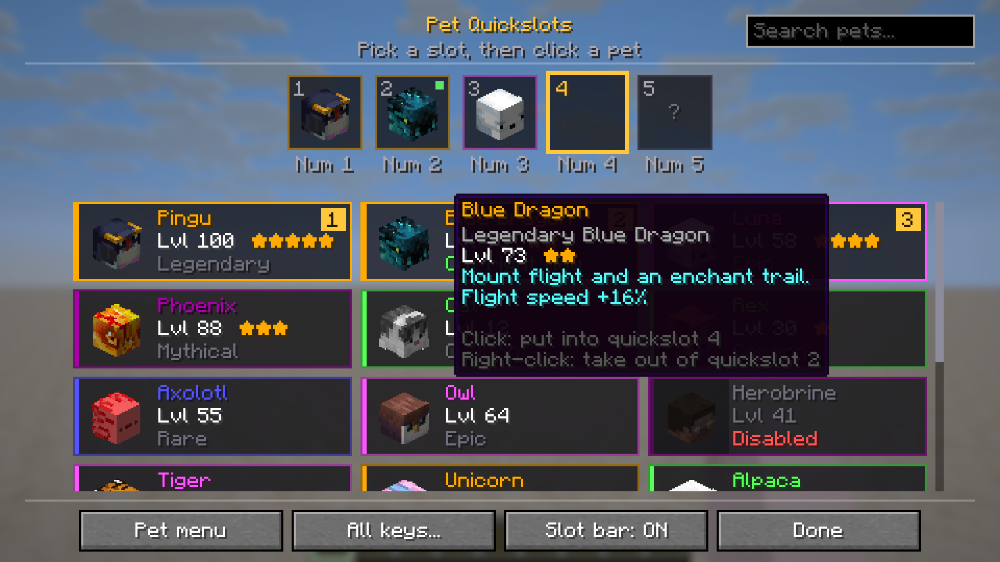
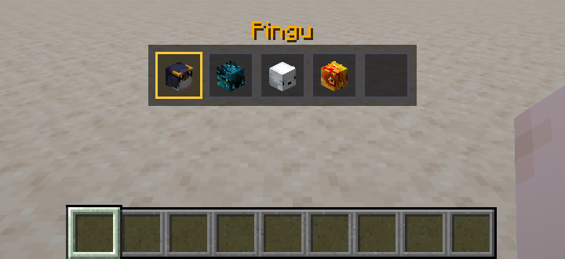
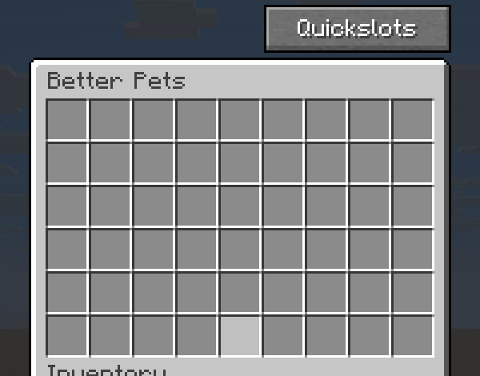

<div align="center">


# Better Pets Quickslots

### Swap pets with one key press.

[](https://www.minecraft.net)
[](https://fabricmc.net)
[](https://github.com/yourShika/betterpets-paper)
[](LICENSE)
[](#built-with-ai-assistance)

[**Download**](https://github.com/yourShika/betterpets-quickslots/releases/latest) ·
[Report a bug](https://github.com/yourShika/betterpets-quickslots/issues/new) ·
[Better Pets plugin](https://github.com/yourShika/betterpets-paper)

</div>

## What it does

On a server that runs the [Better Pets](https://github.com/yourShika/betterpets-paper) plugin
you can park your favourite pets in *quickslots*. The plugin can already switch between them
by command. This mod adds what a server cannot give a vanilla client:



- **Real key bindings.** One key per quickslot, plus next pet, previous pet and put away —
  all freely rebindable.
- **A slot screen.** Pick a slot, click a pet, done. The selection jumps on to the next free
  slot, so filling them all is one click per pet. No chest menu, no commands.
- **A Quickslots button in `/pets`.** Right on the plugin's own pet menu.
- **A slot bar.** It shows above your hotbar for a moment whenever your pet changes, so you
  see what a key press did.



## Installation

1. You need **[Fabric Loader](https://fabricmc.net/use/installer/) 0.19.3 or newer** and
   **[Fabric API](https://modrinth.com/mod/fabric-api)**.
2. [Download the mod](https://github.com/yourShika/betterpets-quickslots/releases/latest) and
   drop the `.jar` into your `mods` folder.
3. Join a server that runs **Better Pets 1.32.0 or newer**.

Client-side only. On a server without the plugin the mod does nothing at all, so it is safe
to leave in a modpack.

## Keys

Everything is listed under **Options → Controls → Key Binds → Better Pets**. The slot keys can
also be changed right in the slot screen: click the key shown under a slot and press the new
one.

| Action | Default |
| --- | --- |
| Quickslot 1 – 9 | <kbd>Num 1</kbd> – <kbd>Num 9</kbd> |
| Next pet | <kbd>Num +</kbd> |
| Previous pet | <kbd>Num -</kbd> |
| Put pet away | <kbd>Num 0</kbd> |
| Open the slot screen | <kbd>K</kbd> |
| Open the pet menu (`/pets`) | not bound |

The defaults sit on the numeric keypad because the game itself binds nothing there. No
keypad? Rebind them — it takes two clicks.

Pressing the key of the pet that is already out puts it away again (a server can turn that
off).

## In the slot screen

| You do | It does |
| --- | --- |
| Click a slot | chooses it |
| Click a pet | parks it in the chosen slot |
| Right-click a slot, or a parked pet | empties that slot |
| Double-click a slot | summons its pet |
| Click the key under a slot | rebinds it — right-click or <kbd>Esc</kbd> clears it |



## Will it work for me?

| | |
| --- | --- |
| **Minecraft** | 26.2 |
| **Loader** | Fabric 0.19.3+ with Fabric API |
| **Server** | Paper with Better Pets 1.32.0+ |
| **Java** | 25 |

How many quickslots you get, and whether the mod may be used at all, is up to the server.

## Something looks wrong?

<details>
<summary><b>The keys do nothing, or I get "This server does not offer pet quickslots"</b></summary>

<br>

"Does not offer" means the server is not running Better Pets **1.32.0 or newer**.

"Turned off for you" means the plugin is there but said no: either `quickslots.enabled` or
`quickslots.methods.mod` is off in its `config.yml` (both are on by default), or you do not
have the `betterpets.quickslots` permission.

</details>

<details>
<summary><b>A slot shows a "?"</b></summary>

<br>

The pet parked there is not yours at the moment — it was turned back into an item, or traded
away. The slot remembers the kind of pet, so it works again as soon as you own one.

</details>

<details>
<summary><b>The Controls screen shows my slot keys as plain "1", "2", "3"</b></summary>

<br>

That is how Minecraft names the keys of the numeric keypad. The slot screen of this mod spells
them out as "Num 1" and so on, so they are not mistaken for the hotbar keys.

</details>

<details>
<summary><b>How do I report a bug properly</b></summary>

<br>

[Open an issue](https://github.com/yourShika/betterpets-quickslots/issues/new) with your
`logs/latest.log`, the version of the mod and of the Better Pets plugin, and a screenshot if
something looks wrong.

</details>

## For server owners

There is nothing to install besides the plugin. In its `config.yml`:

```yaml
quickslots:
  enabled: true
  slots: 5        # how many quickslots every player has (1 - 9)
  methods:
    mod: true     # false = this mod is ignored on your server
```

The plugin stays in charge. The mod only ever sends requests ("summon the pet of slot 2"), and
every rule — permission, cooldown, disabled pets — is checked on the server. Players without
the mod are not affected by it in any way.

## Built with AI assistance

This mod was written with the help of AI ([Claude](https://claude.com/claude-code)), compiled
against the real game files and run in the real game.

What has been tried, and what hasn't:

- ✅ **Minecraft 26.2 with Fabric Loader 0.19.3 and Fabric API 0.159.0** — `run-preview.sh`
  starts the actual game, and a stand-in for the plugin on the integrated server speaks the
  real protocol to the mod. The handshake, the pet list, parking a pet, switching pets and the
  button on the pet menu (as well as its absence on any other chest) are checked there, and
  the pictures on this page come from that run.
- ⚠️ **Together with a real Better Pets server** — both sides share the protocol file byte for
  byte and the plugin has its own tests for it, but at the time of this release the two have
  not been played together yet.
  [Tell me if something is off](https://github.com/yourShika/betterpets-quickslots/issues/new).
- ⚠️ **Other window sizes** — the layout adapts to the window, but only 1280×720 and 1440×810
  at GUI scale 3 have been looked at.

## For developers

[**TECHNICAL.md**](TECHNICAL.md) describes the protocol, how the pieces fit together, and how
to build and preview the mod without Gradle.

## Credits

- [Better Pets](https://github.com/yourShika/betterpets-paper), the plugin this mod belongs to
- The fox on the icon is part of the Better Pets menu artwork

## License

[MIT](LICENSE) — do what you like with it.
