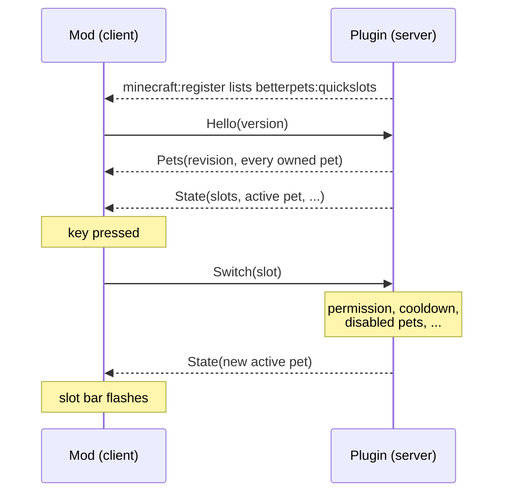

# Technical notes

How the mod and the plugin talk to each other, how the mod is put together, and how to build
and preview it. For the player-facing description see the [README](README.md).

## Who does what

The [Better Pets](https://github.com/yourShika/betterpets-paper) plugin owns everything: the
pets, the quickslots, and every rule about who may summon what and when. The mod is a remote
control with a display. It sends requests, and it draws whatever the plugin last told it.



Nothing is assumed on the client. A key press does not change the active pet locally — only
the plugin's next `State` does, and that same `State` is what makes the slot bar appear. The
one exception is parking a pet in the slot screen, which is shown at once so the screen feels
immediate; the plugin's answer then replaces it with the authoritative state.

## The channel

Plugin messages on `betterpets:quickslots`, in both directions. A Bukkit plugin only ever
sees a byte array on such a channel, so the mod's payload (`QuickslotPayload`) carries raw
bytes too, and all framing lives in one dependency-free file:

```
src/main/java/de/kamil/betterpets/quickslots/QuickslotProtocol.java
```

That file is **byte-identical in the plugin and in the mod**. It uses nothing but `java.io`,
so neither Bukkit nor Minecraft types can creep in. Every message is one opcode byte followed
by its fields, written with `DataOutputStream`.

| Direction | Message | Fields | Meaning |
| --- | --- | --- | --- |
| client → server | `Hello` | version | the mod is there |
| | `RequestPets` | — | send the pet list again (safety net) |
| | `Assign` | slot, pet id | park a pet in a slot; empty id clears it |
| | `Switch` | slot | summon that slot's pet |
| | `Cycle` | direction | next / previous filled slot |
| | `Despawn` | — | put the active pet away |
| server → client | `State` | version, enabled, slots, active pet, cooldown, same-slot-puts-away, pets revision | small, sent often |
| | `Pets` | revision, list of pets | every owned pet with name, rarity colour, level, stars, head texture, ability |
| | `OpenScreen` | — | open the slot screen (`/pets quick`) |
| | `MenuOpened` | — | the plugin's chest menu opens next |

Compatibility rules: fields are only ever appended, readers ignore trailing bytes they do not
know, and an unknown opcode decodes to `null` and is dropped. An older mod therefore keeps
working against a newer plugin and the other way round.

Slots refer to pets by **definition id** (`penguin`), not by the pet's UUID. A player owns at
most one pet per definition, and a pet gets a new UUID when it is converted to an item and
added back — so a slot keyed by definition survives that trip.

## The hello

The mod cannot simply say hello when it joins: at that moment it does not know yet whether
the server listens on the channel. A Bukkit server announces its channels with a
`minecraft:register` message shortly *after* the join, so the hello is sent from Fabric's
`ServerboundPlayChannelEvents.REGISTER`. As a safety net it is repeated every few seconds
while the channel is known but no `State` has arrived.

On a server without the plugin the channel is never announced, nothing is ever sent, and the
mod stays passive. Pressing a key there only shows a short note.

## The button on the pet menu

To the client the plugin's `/pets` menu is an ordinary six-row chest, indistinguishable from
any other, and the plugin has no free slot left in it for one more item button. So the plugin
sends `MenuOpened` right before it opens that menu. The first container screen to appear
after the note is the one; it is then recognised by its container id, because the screen is
rebuilt on every window resize. The button is a normal client-side widget added through
Fabric's `ScreenEvents.AFTER_INIT`.

Opening the slot screen from there calls `closeContainer()` first. Merely replacing the
screen would leave the server believing the chest is still open.

## The pet heads

On the server every pet is a player head carrying a skin texture. The plugin sends that
texture value, and `PetIcons` rebuilds the same head from it, so a pet looks exactly as it
does in the plugin's own menu. Items can only be created once the game has loaded its item
data — in a world, not on the title screen — which is why the icon cache is filled lazily and
why the preview below has to enter a world.

## Building

No Gradle, no Loom. Minecraft 26.x ships with real class names, and the jar declares
`Fabric-Mapping-Namespace: official`, so nothing is remapped at runtime and the mod compiles
directly against the game jar of an existing installation.

```bash
bash build.sh
```

Produces `betterpets-quickslots-<version>.jar`. It needs a JDK 25, a launcher directory with
Minecraft and the Fabric loader installed, and a Fabric API jar for that Minecraft version.
Override the defaults as needed:

```bash
MCROOT=/path/to/.minecraft FABRIC_API=/path/to/fabric-api.jar JDK=/path/to/jdk-25 bash build.sh
```

`tools/classpath.py` reads the launcher's version JSON to list the libraries, the same way a
launcher does.

## Previewing and testing without a server

```bash
bash build.sh && bash run-preview.sh
```

This starts the real game in the throw-away directory `run/`, generates a creative test
world, and on that world's integrated server `PreviewServer` plays the plugin's part over the
real channel with the pets from `tools/preview-pets.tsv`. `DevPreview` then walks through the
mod without any input and checks each step:

- the handshake — state and pet list have to arrive on their own;
- parking a pet and switching pets, each checked on both ends;
- the button on the announced pet menu, and its absence on an ordinary chest;
- that the server is told the chest was closed when the slot screen opens from it.

The results are printed and written to `run/preview-report.txt`; the script exits non-zero if
a check fails. Screenshots of the screen, two tooltips, the slot bar and the menu button land
in `run/screenshots/`. `GUI_SCALE`, `LANGUAGE`, `WIDTH` and `HEIGHT` change what is rendered.

Both classes are inert unless the game is started with
`-Dbetterpets.quickslots.preview=<pets.tsv>`.

What this does not cover is the plugin itself: `PreviewServer` speaks the same bytes, but it
is not the plugin. The plugin has its own tests for the protocol and the slot logic.
