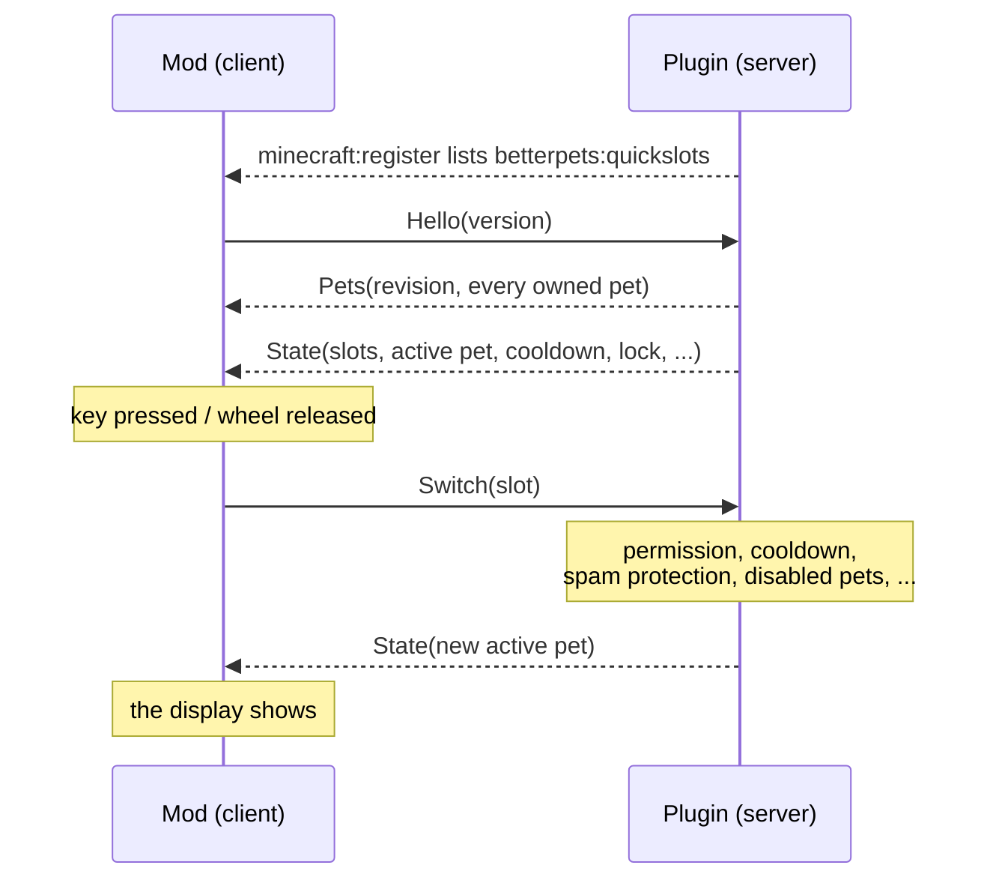

# Technical notes

How the mod and the plugin talk to each other, how the mod is put together, and how to build
and preview it. For the player-facing description see the [README](README.md).

## Who does what

The [Better Pets](https://github.com/yourShika/betterpets-paper) plugin owns everything: the
pets, the quickslots, and every rule about who may summon what and when. The mod is a remote
control with a display. It sends requests, and it draws whatever the plugin last told it.



Nothing is assumed on the client. A key press does not change the active pet locally — only
the plugin's next `State` does, and that same `State` is what makes the display appear. The
one exception is parking a pet in the slot screen, which is shown at once so the screen feels
immediate; the plugin's answer then replaces it with the authoritative state.

## The channel

Plugin messages on `betterpets:quickslots`, in both directions. A Bukkit plugin only ever
sees a byte array on such a channel, so the mod's payload (`QuickslotPayload`) carries raw
bytes too, and all framing lives in one dependency-free file:

```
src/main/java/de/kamil/betterpets/quickslots/QuickslotProtocol.java
```

That file is **byte-identical in the plugin and in the mod**. It uses nothing but `java.io`,
so neither Bukkit nor Minecraft types can creep in. Every message is one opcode byte followed
by its fields, written with `DataOutputStream`.

| Direction | Message | Fields | Meaning |
| --- | --- | --- | --- |
| client → server | `Hello` | version | the mod is there |
| | `RequestPets` | — | send the pet list again (safety net) |
| | `Assign` | slot, pet id | park a pet in a slot; empty id clears it |
| | `Switch` | slot | summon that slot's pet |
| | `Cycle` | direction | next / previous filled slot |
| | `Despawn` | — | put the active pet away |
| server → client | `State` | version, enabled, slots, active pet, cooldown, same-slot-puts-away, pets revision, *lockout* | small, sent often |
| | `Pets` | revision, list of pets | every owned pet with name, rarity colour, level, stars, head texture, ability |
| | `OpenScreen` | — | open the slot screen (`/pets quick`) |
| | `MenuOpened` | — | the plugin's chest menu opens next |

Compatibility rules: fields are only ever appended, readers ignore trailing bytes they do not
know, an appended field is optional for the reader, and an unknown opcode decodes to `null`
and is dropped. An older mod therefore keeps working against a newer plugin and the other way
round. The *lockout* field is the first use of that: Better Pets 1.33.0 appends the remaining
milliseconds of a spam lock to `State`; mod 1.0.0 ignores the extra bytes, and mod 1.1.0
reads a `State` from plugin 1.32.0 as "not locked".

Slots refer to pets by **definition id** (`penguin`), not by the pet's UUID. A player owns at
most one pet per definition, and a pet gets a new UUID when it is converted to an item and
added back — so a slot keyed by definition survives that trip.

## The hello

The mod cannot simply say hello when it joins: at that moment it does not know yet whether
the server listens on the channel. A Bukkit server announces its channels with a
`minecraft:register` message shortly *after* the join, so the hello is sent from Fabric's
`ServerboundPlayChannelEvents.REGISTER`. As a safety net it is repeated every few seconds
while the channel is known but no `State` has arrived.

On a server without the plugin the channel is never announced, nothing is ever sent, and the
mod stays passive. Pressing a key there only shows a short note.

## Switching, and holding back

`Keybinds` turns input into requests, `QuickslotClient` decides whether a request is sent.

- **Direct keys** and the keys for the screens are ordinary key bindings, read once per tick.
- **The pet wheel** (`WheelScreen`, drawn by `WheelRenderer`) opens on its key and asks every
  frame whether that key is still down — a screen does not reliably get to see the release of
  a key that was pressed before it opened. Only the direction from the centre counts
  (`WheelRenderer.pointedSlot`), with a dead zone in the middle.
- **The modifier key with 1–9**: at the *start* of each client tick, before the game looks at
  its own bindings, `Keybinds.pollEarly` takes the pending presses of the hotbar keys away if
  the modifier is down. The game then finds nothing to do, and the hotbar stays put.
- **The modifier key with the mouse wheel** is the one thing that needs a mixin
  (`MouseHandlerMixin`, at the head of `MouseHandler.onScroll`): the game offers no event for
  the wheel outside of screens, and undoing the hotbar change a tick later would flicker.

A press only counts when the key was not already down at the last poll, so the keyboard's
auto-repeat cannot turn one held key into a stream of switches. On top of that
`QuickslotClient.mayRequestSwitch` sends nothing during the cooldown the server announced,
during a lock, or within 150 ms of the previous request — the display shows the wait instead
(`QuickslotHud.onRefused`). None of this is trusted by the server: the plugin enforces
cooldown and spam protection itself and caps the messages it accepts per second.

## Screens and drawing

Nothing uses the game's stock widgets for its look. `tools/make_sprites.py` draws the panels,
slots, switches, sliders, key caps and the wheel as GUI sprites in the colours of the Better
Pets menu artwork (the stretchable ones are nine-sliced through their `.mcmeta`), and copies
the icons and characters over from that artwork. `ui/Sprites` names them, `ui/Draw` holds the
shared drawing helpers, `ui/TextButton` is a regular game button with the mod's look, and the
tooltips get their own background through a tooltip style (`tooltip/wood_*`).

`ui/Anim` is the motion: easing curves, timed progress and frame-rate independent smoothing,
all on wall-clock time. The "animations" setting switches it off as a whole — every timed
animation then reports itself finished and every smoothed value sits on its target.

The display on the HUD and the wheel are drawn by `HudRenderer` and `WheelRenderer`, which
take the rectangle to draw into as a parameter. The settings screen calls the very same code
for its preview — once scaled down onto a small copy of the screen (`SettingsPreview`), once
across the real screen for the full-size preview — so a preview cannot look different from
the real thing. What the preview shows is make-believe (`SlotView.forPreview`, a little loop
of "pet switched … modifier held"); nothing is sent to the server from there.

Settings live in `config/betterpets-quickslots.json` (`ModConfig`), key bindings in the
game's own `options.txt`.

## The button on the pet menu

To the client the plugin's `/pets` menu is an ordinary six-row chest, indistinguishable from
any other, and the plugin has no free slot left in it for one more item button. So the plugin
sends `MenuOpened` right before it opens that menu. The first container screen to appear
after the note is the one; it is then recognised by its container id, because the screen is
rebuilt on every window resize. The button is a normal client-side widget added through
Fabric's `ScreenEvents.AFTER_INIT`.

Opening the slot screen from there calls `closeContainer()` first. Merely replacing the
screen would leave the server believing the chest is still open.

## The pet heads

On the server every pet is a player head carrying a skin texture. The plugin sends that
texture value, and `PetIcons` rebuilds the same head from it, so a pet looks exactly as it
does in the plugin's own menu. Items can only be created once the game has loaded its item
data — in a world, not on the title screen — which is why the icon cache is filled lazily,
why the previews fall back to icon sprites outside a world, and why the test run below has to
enter one.

## Building

No Gradle, no Loom. Minecraft 26.x ships with real class names, and the jar declares
`Fabric-Mapping-Namespace: official`, so nothing is remapped at runtime and the mod compiles
directly against the game jar of an existing installation. The mixin needs no refmap for the
same reason.

```bash
bash build.sh
```

Produces `betterpets-quickslots-<version>.jar`. It needs a JDK 25, a launcher directory with
Minecraft and a Fabric profile for it (such as `26.2-fabric0.19.3`), and a Fabric API jar for
that Minecraft version. Override the defaults as needed:

```bash
MCROOT=/path/to/.minecraft FABRIC_API=/path/to/fabric-api.jar JDK=/path/to/jdk-25 bash build.sh
```

`tools/classpath.py` reads the launcher's version JSON to list the libraries, the same way a
launcher does. `stubs/` holds compile-only copies of the two Mod Menu interfaces the
`modmenu` entrypoint implements, so no Mod Menu jar is needed to build; they are not packaged.

The sprites are checked in. To redraw them (needs Python with Pillow and the Better Pets
artwork folder):

```bash
python tools/make_sprites.py /path/to/Better\ Pets/paper-plugin/GUI
```

## Previewing and testing without a server

```bash
bash build.sh && bash run-preview.sh
```

This starts the real game in the throw-away directory `run/`, generates a creative test
world, and on that world's integrated server `PreviewServer` plays the plugin's part over the
real channel with the pets from `tools/preview-pets.tsv`. `DevPreview` then walks through the
mod as a script of timed steps, without any input from a person, and checks each one:

- the handshake — state and pet list have to arrive on their own;
- parking a pet with real clicks on a slot and a card, checked on both ends;
- switching pets, and that a double press and a press during the cooldown send one request,
  and a press during a lock none (`PreviewServer` enforces nothing, so whatever reaches it is
  what the mod let through);
- the wheel, both by click and by holding its key and letting go over a pet;
- the modifier key with a number and with the mouse wheel — and that both leave the hotbar
  alone, while without the modifier they are the game's;
- the settings: a switch, a choice, a slider and dragging the display in the full-size
  preview, each by clicking where the control is drawn;
- the button on the announced pet menu, its absence on an ordinary chest, and that the server
  is told the chest was closed when the slot screen opens from it.

Clicks and key presses go through the screens' own event methods and the game's key bindings;
the mouse is moved and its wheel turned through the game's (private) mouse callbacks, so the
mixin is on the path. A key is "held" by answering the mod's question whether it is down
(`Keybinds.physicallyDown`) — the one seam that exists for the test alone.

The results are printed and written to `run/preview-report.txt`; the script exits non-zero if
a check fails. Screenshots of every screen and state land in `run/screenshots/`, and the
frames of two short films — the wheel being used, the settings being worked — in
`run/screenshots/film/` (that is where the moving pictures in the README come from).
`GUI_SCALE`, `LANGUAGE`, `WIDTH` and `HEIGHT` change what is rendered, and `EXTRA_MODS` puts
more mods into the test instance: with Mod Menu among them, the run also asks the mod for its
config screen the way Mod Menu does.

The run needs no keyboard and no mouse — the pointer it works with is its own — so on Windows
it can happen out of sight: `HIDDEN=1 bash run-preview.sh` starts the game on a desktop of
its own (`tools/run-hidden.ps1`). It renders as usual, but no window appears and nothing
takes the focus away from whatever else is going on.

`DevPreview` and `PreviewServer` are inert unless the game is started with
`-Dbetterpets.quickslots.preview=<pets.tsv>`.

What this does not cover is the plugin itself: `PreviewServer` speaks the same bytes, but it
is not the plugin. The plugin has its own tests for the protocol, the slot logic and the spam
guard.
